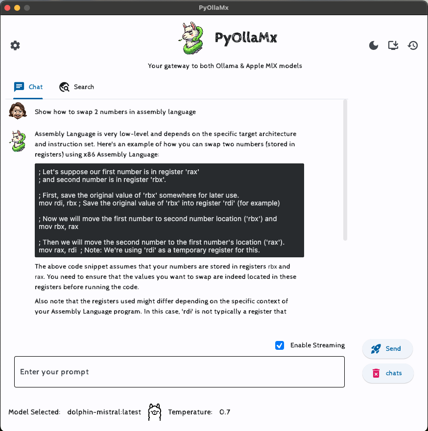

# PyOllaMx (Ollama + MlX)
#### `Your gateway to both Ollama & Apple MlX models`

### 

Inspired by [Ollama](https://github.com/ollama/ollama), [Apple MlX](https://github.com/ml-explore/mlx) projects and frustrated by the dependencies from external applications like Bing, Chat-GPT etc, I wanted to have my own personal chatbot as a native MacOS application. Sure there are alternatives like streamlit, gradio (which are based, thereby needing a browser) or others like Ollamac, LMStudio, mindmac etc which are good but then restrictive in some means (either by license, or paid or not versatile). Also I wanted to enjoy both Ollama (based on `llama.cpp`) and Mlx models (which are suitable for image generation, audio generation etc and heck I own a mac with Apple silicon 👨🏻‍💻) through a single uniform interface.

All these lead to this project (PyOllaMx) and another sister project called [PyOMlx](https://github.com/kspviswa/PyOMlx).

I'm using these in my day to day workflow and I intend to keep develop these for my use and benefit.

If you find this valuable, feel free to use it and contribute to this project as well. Please ⭐️ this repo to show your support and make my day!

I'm planning on work on next items on this [roadmap.md](roadmap.md). Feel free to comment your thoughts (if any) and influence my work (if interested)

MacOS DMGs are available in [Releases](https://github.com/kspviswa/pyOllaMx/releases)

## PyOllaMx vs PyOMlx

[PyOllaMx](https://github.com/kspviswa/pyOllaMx) : ChatBot application capable of chatting with both Ollama and Apple MlX models. For this app to function, it needs both [Ollama](https://github.com/ollama/ollama) & [PyOMlx](https://github.com/kspviswa/PyOMlx) macos app running. These 2 apps will serve their respective models on localhost for PyOllaMx to chat.

[PyOMlx](https://github.com/kspviswa/PyOMlx) : A Macos App capable of discovering, loading & serving Apple MlX models downloaded from [Apple MLX Community repo in hugging face](https://huggingface.co/mlx-community) 🤗

## Star History

[](https://star-history.com/#kspviswa/pyOllaMx&Date)

## How to use?

1) Install [Ollama Application](https://ollama.ai/download) & use Ollama CLI to download your desired models
```
ollama pull <model name>
ollama pull mistral
```
This command will download the Ollama models in a known location to PyOllaMx

> [!TIP]
> As of PyOllaMx v0.0.4, you can download & manage ollama models right within PyOllaMx's ModelHub. Check the [v0.0.4 release page](https://github.com/kspviswa/pyOllaMx/releases/tag/v0.0.4) for more details

2) Install [MlX Models from Hugging Face repo](https://huggingface.co/mlx-community).

use hugging-face cli
```
pip install huggingface_hub hf_transfer

export HF_HUB_ENABLE_HF_TRANSFER=1
huggingface-cli download mlx-community/CodeLlama-7b-Python-4bit-MLX
```
This command will download the MlX models in a known location to PyOllaMx

3) Now simply open the **PyOllaMx** and start chatting



## [v0.0.4 Features](https://github.com/kspviswa/pyOllaMx/releases/tag/v0.0.4)

### New Functionality
Now you can download Ollama models right within 🤌🏻 PyOllaMx's Model Hub tab. You can also inspect existing models 🧐, delete models 🗑️ right within PyOllaMx instead of using Ollama CLI. This greatly simplifies the user experience 🤩🤩. And you before you ask, yes I'm working to bring similar functionality for MLX models from huggingface hub. Please stay tuned 😎

### BugFixes
1. Updated DDGS dependency to fix some of the rate limit issues

Click the release version link above ☝🏻 to view demo gifs explaining the features.

## [v0.0.3 Features](https://github.com/kspviswa/pyOllaMx/releases/tag/v0.0.3)

1. Dark mode support - Toggle between Dark & Light mode with a click of the icon
2. Model settings menu - Brand new settings menu to set the model name and the temperature along with Ollama & MlX model toggle
3. Streaming support - Streaming support for both chat & search tasks
4. Brand New Status bar - Status bar that displays the selected mode name, model type & model temperature
5. Web search enabled for Apple MlX models - Now you can use Apple MlX models to power the web search when choosing the search tab

Click the release version link above ☝🏻 to view demo gifs explaining the features.

## [v0.0.2 Features](https://github.com/kspviswa/pyOllaMx/releases/tag/v0.0.2)

1. Web search capability _(powered by DuckDuckGo search engine via https://github.com/deedy5/duckduckgo_search)_
    a. Web search powered via basic RAG using prompt engineering. More advanced techniques are in pipeline
    b. Search response will cite clickable sources for easy follow-up / deep dive
    c. Beneath every search response, search keywords are also shown to verify the search scope
    d. Easy toggle between chat and search operations 
2. Clear / Erase history 
3. Automatic scroll on chat messages for better user experience
4. Basic error & exception handling for searches

Limitations:

- Web search only enabled for Ollama models. Use dolphin-mistral:7b model for better results. MlX model support is planned for next release
- Search results aren't deterministic and vary vastly among the chosen models. So play with different models to find your optimum
- Sometimes search results are gibberish. It is due to the fact that search engine RAG is vanilla i.e done via basic prompt engineering without any library support. So re-trigger the same search prompt and see the response once again if the results aren't satisfactory.

Click the release version link above ☝🏻 to view demo gifs explaining the features.

## [v0.0.1 Features](https://github.com/kspviswa/pyOllaMx/releases/tag/v0.0.1)

- Auto discover Ollama & MlX models. Simply download the models as you do with respective tools and pyOllaMx would pull the models seamlessly
- Markdown support on chat messages for programming code
- Selectable Text
- Temperature control
